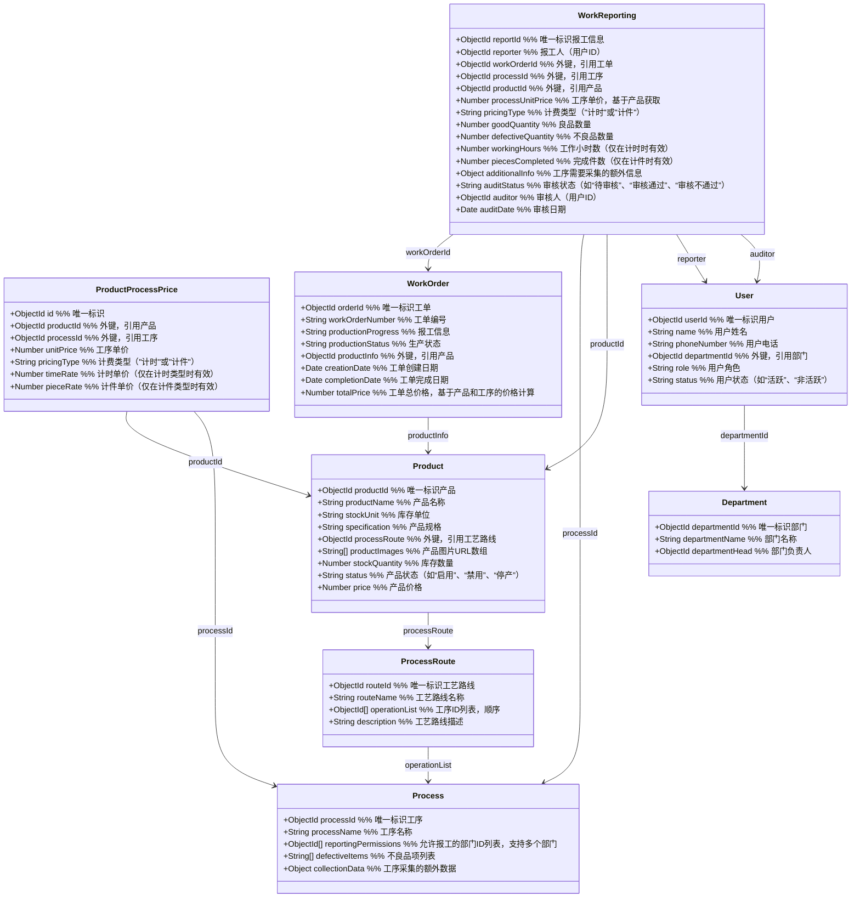

## 修改 npm 代理

打开 cmd 或 powershell，通过命令行为 npm 设置代理

|                 |                                                                                                                                             |
| --------------- | ------------------------------------------------------------------------------------------------------------------------------------------- |
| 1   2   3 | # clash 默认的隧道地址为http://127.0.0.1:7890   npm config set proxy http://127.0.0.1:7890   npm config set https-proxy http://127.0.0.1:7890 |

如果要取消代理，通过

|          |                                                            |     |
| -------- | ---------------------------------------------------------- | --- |
| 1   2 | npm config delete proxy   npm config delete https-proxy |     |

![[Pasted image 20250103111402.png]]